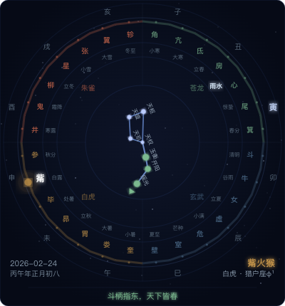

# 璇玑星图 — macOS 桌面组件

基于 Übersicht 的 macOS 桌面星图组件，展示中国传统天文历法数据。



## 功能

- **北斗七星**：基于真实赤经赤纬投影，连线 + 七星名标注，整体随斗柄角度旋转
- **二十八宿环**：四象分组色彩编码（苍龙绿/朱雀红/白虎金/玄武蓝），当日值宿发光高亮
- **二十四节气环**：当前节气高亮
- **十二地支环**：当前月建高亮
- **深空视觉**：径向渐变背景 + 散点星场 + SVG 发光滤镜

## 数据源

读取 `~/.tcm-bar-cache.json`，由 [tcm-bar](https://github.com/shaoguos/tcm-bar) 的 `fetch_tcm.sh` 定时生成。

JSON 中使用的字段：
- `mansion` — 当日值宿（index / name / group / star）
- `bigDipper` — 北斗斗柄（handleAngle / direction / monthDizhi / directionText）
- `solarTerm` — 当前节气
- `date` — 日期信息

## 部署

### 前置条件

- macOS
- [Übersicht](http://tracesof.net/uebersicht/) 已安装
- `~/.tcm-bar-cache.json` 数据文件存在

### 安装

```bash
cp star-chart.widget/index.jsx ~/Library/Application\ Support/Übersicht/widgets/star-chart.jsx
```

Übersicht 会自动检测并加载。

## 适用环境

- macOS (Apple Silicon / Intel)
- Übersicht 1.6+
- 自用项目，仅供参考

## 源自

星图渲染逻辑来自 [openclaw](https://github.com/anthropics/openclaw) 岐黄工作区，数据由 `generate_daily_data.py` 基于 `pyephem` 天文算法生成。
